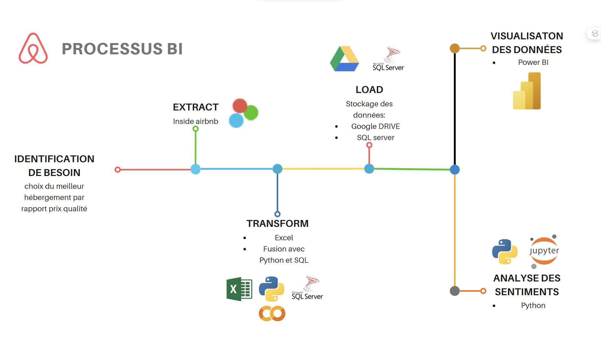

# Airbnb-analyses

---

🚀 Excited to share the success of our recent project where we implemented the entire data analysis process! 📊💻

🔍 It all started with importing data from Inside Airbnb, a true goldmine of information! We then organized this data using Google Drive and SQL Server as our data warehouse to ensure efficient and optimized management.

💡 Data cleaning was our next crucial step. Using advanced techniques in Excel, we ensured the quality and integrity of the data. Using Google Colab and SQL Server, we seamlessly merged data, creating a solid foundation for our in-depth analysis.

📊 Thanks to Power BI, we developed an intuitive dashboard, providing impactful visual insights. But our journey didn't stop there! We delved into analyzing the sentiments of Airbnb customer comments using Jupyter, Python, TextBlob, Pandas, and Matplotlib.

🕵️‍♂️ We analyzed over 1,500,000 comments, carefully classifying them as positive, negative, or neutral. This approach allowed us to deeply understand customer reactions, paving the way for continuous improvements and informed decisions.

💬 The power of data is truly extraordinary, and I'm proud of the team for successfully navigating these challenges! If you have any questions about our journey or how we can collaborate, feel free to reach out. 🌐 #DataAnalytics #DataDrivenDecisions #ProjectSuccess #DataScience #PowerBI #PythonAnalysis 🚀💡

